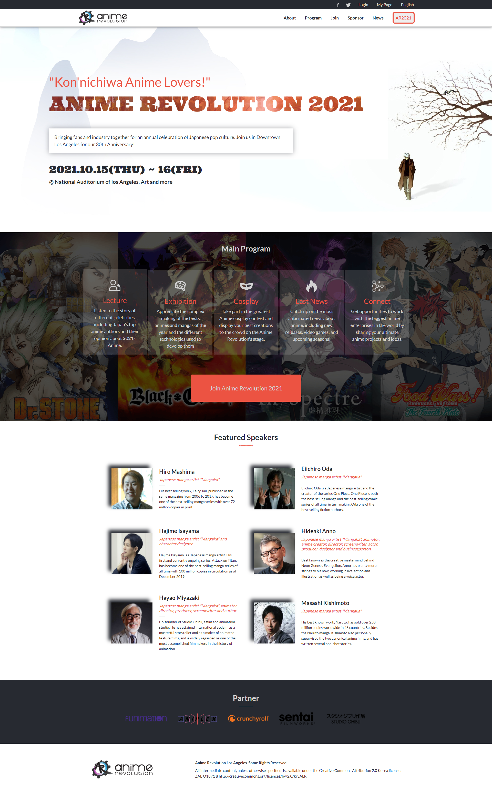

## Anime Revolution 2021

Capstone 1: HTML/CSS. Building a responsive site for a "client" who has provided guidelines for his brand.

## Screenshot

The main goal of this project is to test the HTML and CSS skills that one has. Secondarily it also tests the knowledge of other technologies such as bootstrap and media queries by building a website following a pre-designed design of a "client". In this project, it is supposed to follow the design chosen by the client (fonts, colors, structure, etc.) to simulate the real work of a web developer. It is not only a good project to test practical skills but also to get our creativity going by choosing the theme of the page and building everything from there. In this case, I chose to simulate an Anime Convention theme, go ahead and take a look. 

I hope you enjoy it!

## Anime Revolution 2021 with the following features:

- Bootstrap (containers and their respective rows and columns, dropdowns, navbars, etc.)

- Media queries for different screen sizes

- Responsiveness

## Built With

- HTML

- CSS

- Bootstrap

- Media queries

## Live Demo

[Live Demo Link](https://peaceful-bose-852830.netlify.app)

**See the page via the link above**

## Author

👤 **Andrik Solis**

- GitHub: [Andrik27001](https://github.com/Andrik27001)
- Twitter: [@Andrik22693566](https://twitter.com/Andrik22693566)
- LinkedIn: [LinkedIn](https://www.linkedin.com/in/andrik-solis-paniagua-a0ab251b5/)

## Show your support

Give a ⭐️ if you like this project!

## 📝 License

This project is [MIT](LICENSE) licensed.
